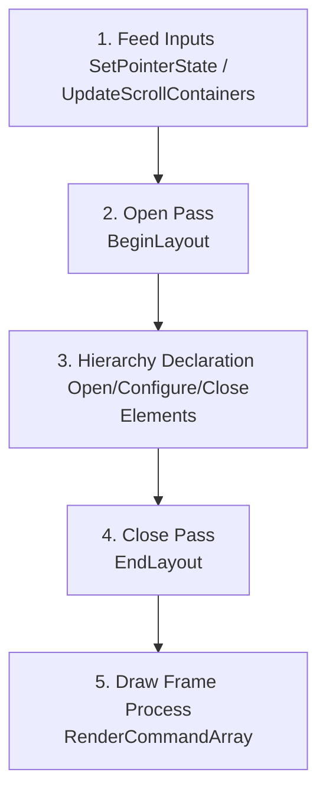

# ClaySharp Interop Layer

The `ClaySharp.Interop` namespace provides low-level, zero-overhead, high-performance C# bindings to **Clay**—a single-header C library designed for fast 2D user interface layout. 

Because Clay is built for high-performance applications (such as game engines, desktop shells, and native applications), the C# interop layer is designed to run with **absolute minimum CPU and memory overhead**.

---

## 🛠 Key Architectural Pillars

### 1. Source-Generated Interop (`[LibraryImport]`)
Instead of using classic, runtime-marshaled P/Invoke via `[DllImport]`, ClaySharp utilizes modern .NET source-generated interop using `[LibraryImport]`.

* **Compile-Time Marshalling:** Marshalling code is generated at compile time by the Roslyn compiler. This eliminates runtime reflection, IL generation, and JIT overhead when transitioning across the managed/unmanaged boundary.
* **No Runtime Marshalling Overhead:** The project disables runtime marshalling globally:
  ```csharp
  [assembly: DisableRuntimeMarshalling]
  ```
  This forces the runtime to pass structures directly bit-for-bit (blitting) over the ABI, guaranteeing native C performance.
* **Optimized Transitions:** High-frequency, side-effect-free querying functions are annotated with `[SuppressGCTransition]` (e.g., `GetCurrentContext()`, `Hovered()`, `GetMaxElementCount()`). This instructs the .NET runtime to omit the garbage collector transition state machine, saving precious CPU cycles on every call.

---

### 2. Unmanaged Memory & Arena Allocator
Clay does not perform dynamic heap allocations (`malloc`/`free`) during layout computation. Instead, it relies on a single, contiguous memory buffer managed as a linear arena.

```
┌─────────────────────────────────────────────────────────────┐
│                       Unmanaged Memory Arena                │
├───────────────────┬─────────────────────────────────────────┤
│ NextAllocation ──►│ Free / Available Space                  │
└───────────────────┴─────────────────────────────────────────┘
```

* **Setting Up Backing Storage:** Before initializing Clay, you must query the minimum memory size required and allocate a raw unmanaged block:
  ```csharp
  uint minMemoryBytes = ClayNative.MinMemorySize();
  void* arenaMemoryBacking = (void*)Marshal.AllocHGlobal((int)minMemoryBytes);
  ```
* **Arena Lifecycle:** Create the `Arena` structure, pass it to `Clay_Initialize`, and remember to free the allocated block on application shutdown:
  ```csharp
  Arena arena = ClayNative.CreateArenaWithCapacityAndMemory((UIntPtr)minMemoryBytes, arenaMemoryBacking);
  ClayNative.Clay_Initialize(arena, viewportDimensions, errorHandler);
  
  // On Shutdown:
  Marshal.FreeHGlobal((IntPtr)arenaMemoryBacking);
  ```

---

### 3. String Handling & ABI Safety
C# managed strings (`System.String`) are heap-allocated, garbage-collected, and UTF-16 encoded. Native Clay expects unmanaged, UTF-8 or ANSI null-terminated character byte sequences.

To bridge this gap without creating heap allocations or garbage collector pressure:
* **`ClayString`:** Represents a native string pointer. It contains `Chars` (a raw `byte*` pointer) and `Length`. 
* **`ClayStringSlice`:** Used during text wrapping and measurement callbacks. It represents a segment of a base string and contains a `BaseChars` pointer alongside the sliced segment `Chars` pointer and `Length`.
* **String Allocation Safety:** Static strings (like constant keys or literals) can set `IsStaticallyAllocated = true` to let the engine know their lifetime is infinite. Dynamic strings must have their unmanaged backing byte array alive for the duration of the layout frame.

---

### 4. Emulation of C-Style Unions
C structures often utilize overlapping memory unions to save space or support polymorphism. C# does not support unions natively, so ClaySharp emulates them using explicit structure layouts:

```csharp
[StructLayout(LayoutKind.Explicit)]
public partial struct RenderData
{
    [FieldOffset(0)] public RectangleRenderData Rectangle;
    [FieldOffset(0)] public TextRenderData Text;
    [FieldOffset(0)] public ImageRenderData Image;
    [FieldOffset(0)] public CustomRenderData Custom;
    [FieldOffset(0)] public BorderRenderData Border;
    [FieldOffset(0)] public ClipRenderData Clip;
}
```

* **Memory Layout Overlay:** Setting `[StructLayout(LayoutKind.Explicit)]` and pointing all overlapping fields to `[FieldOffset(0)]` forces them to share the exact same starting byte in unmanaged memory.
* **Access Safety:** When processing rendering commands, you must **always** check `RenderCommand.CommandType` before reading from the union fields. Reading the wrong field (e.g. accessing `Rectangle` when the type is `Text`) will result in corrupt garbage data or memory access violations.

---

## 🔄 The Layout Frame Lifecycle

Every frame of your application UI lifecycle must follow a strict, sequential series of native calls:



1. **Feed Inputs:** Update Clay's input state using mouse position, button clicks, and scroll wheel deltas:
   ```csharp
   ClayNative.SetPointerState(new Vector2 { X = mouseX, Y = mouseY }, isMouseDown);
   ClayNative.UpdateScrollContainers(enableDragScrolling, scrollDelta, deltaTime);
   ```
2. **Open Pass:** Signal the start of the layout pass:
   ```csharp
   ClayNative.BeginLayout();
   ```
3. **Declare Hierarchy:** Define UI elements in a tree structure. ClaySharp facilitates this cleanly using C# disposable scopes (`using` statements):
   ```csharp
   using (ClayUI.Panel(in parentPanelDeclaration))
   {
       using (ClayUI.Container(in childElementDeclaration))
       {
           // Declare layout elements or text
       }
   }
   ```
4. **Close Pass:** Signal that structural declarations are complete. Clay will calculate sizing, run layout algorithms, and return a contiguous list of rendering instructions:
   ```csharp
   RenderCommandArray renderCommands = ClayNative.EndLayout();
   ```
5. **Draw Frame:** Loop over the unmanaged command array and paint them using your target graphics renderer (e.g. SkiaSharp, OpenGL, Vulkan):
   ```csharp
   for (int i = 0; i < renderCommands.Length; i++)
   {
       RenderCommand* command = ClayNative.RenderCommandArray_Get(renderCommands, i);
       if (command == null) continue;
       
       switch (command->CommandType)
       {
           case RenderCommandType.Rectangle:
               DrawRectangle(command->BoundingBox, command->RenderData.Rectangle);
               break;
           case RenderCommandType.Text:
               DrawText(command->BoundingBox, command->RenderData.Text);
               break;
           // ... Handle other command types
       }
   }
   ```

---

## 💡 Practical Integration Example

Below is a minimal, complete blueprint showing how to initialize the arena, bind a text measurement callback, and execute a layout frame:

```csharp
using System;
using System.Runtime.InteropServices;
using ClaySharp.Interop;

public static unsafe class ClayApp
{
    private static void* _backingMemory;

    public static void Initialize(int width, int height)
    {
        // 1. Determine arena size and allocate unmanaged memory
        uint minBytes = ClayNative.MinMemorySize();
        _backingMemory = (void*)Marshal.AllocHGlobal((int)minBytes);
        
        // 2. Initialize the Memory Arena
        Arena arena = ClayNative.CreateArenaWithCapacityAndMemory((UIntPtr)minBytes, _backingMemory);
        
        // 3. Setup diagnostics error logging
        var errorHandler = new ErrorHandler
        {
            ErrorHandlerFunction = Marshal.GetFunctionPointerForDelegate(new Action<ErrorData>(OnClayError)),
            UserData = null
        };
        
        // 4. Initialize Context
        var dimensions = new Dimensions { Width = width, Height = height };
        ClayNative.Clay_Initialize(arena, dimensions, errorHandler);

        // 5. Provide a text measurement function (mandatory for layouts containing text elements)
        var measureCallback = new ClayNative.Clay_MeasureTextCallback(MeasureText);
        ClayNative.SetMeasureTextFunction(Marshal.GetFunctionPointerForDelegate(measureCallback), null);
    }

    public static void UpdateAndRender(float mouseX, float mouseY, bool isClicking)
    {
        // 1. Feed input details
        ClayNative.SetPointerState(new Vector2 { X = mouseX, Y = mouseY }, isClicking);

        // 2. Compute Layout
        ClayNative.BeginLayout();
        
        var panel = new ElementDeclaration
        {
            Id = ClayNative.GetElementId(CreateClayString("root_panel")),
            BackgroundColor = new Color { R = 24, G = 24, B = 27, A = 255 }, // Zinc-900
            Layout = new LayoutConfig
            {
                LayoutDirection = LayoutDirection.TopToBottom,
                Padding = new Padding { Left = 16, Right = 16, Top = 16, Bottom = 16 },
                ChildGap = 8
            }
        };

        // Open structural scopes using C# resource scopes
        using (new ClayElementScope(in panel))
        {
            // Add UI child declarations here...
        }

        RenderCommandArray commands = ClayNative.EndLayout();

        // 3. Render Output
        RenderUI(commands);
    }

    private static void RenderUI(RenderCommandArray commands)
    {
        for (int i = 0; i < commands.Length; i++)
        {
            RenderCommand* cmd = ClayNative.RenderCommandArray_Get(commands, i);
            if (cmd == null) continue;

            // Paint cmd->BoundingBox using cmd->CommandType and cmd->RenderData
        }
    }

    private static Dimensions MeasureText(ClayStringSlice text, TextElementConfig* config, void* userData)
    {
        // Perform text measurement based on registered FontId and FontSize...
        return new Dimensions { Width = text.Length * 8f, Height = config->FontSize };
    }

    private static void OnClayError(ErrorData error)
    {
        string message = Marshal.PtrToStringAnsi((IntPtr)error.ErrorText.Chars, error.ErrorText.Length);
        Console.WriteLine($"[Clay Error] {error.ErrorType}: {message}");
    }

    private static ClayString CreateClayString(string text)
    {
        return new ClayString
        {
            Chars = (byte*)Marshal.StringToHGlobalAnsi(text),
            Length = text.Length,
            IsStaticallyAllocated = false
        };
    }

    public static void Shutdown()
    {
        if (_backingMemory != null)
        {
            Marshal.FreeHGlobal((IntPtr)_backingMemory);
            _backingMemory = null;
        }
    }
}
```
